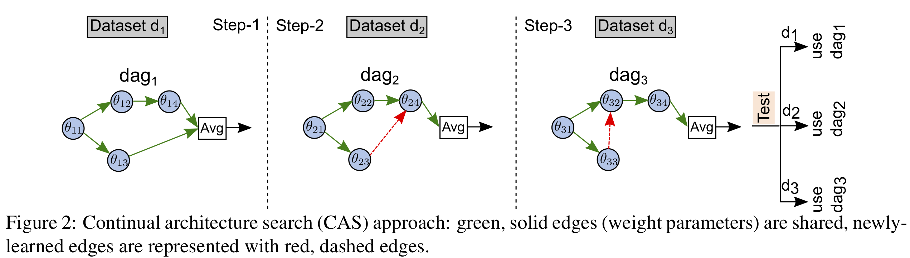
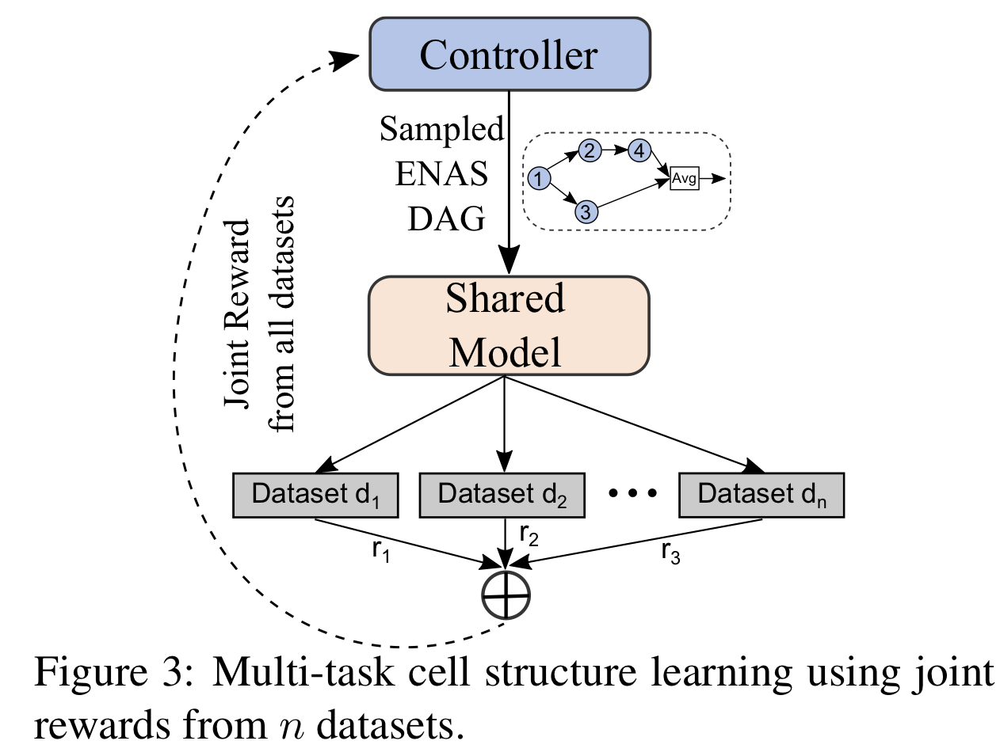

# Continual and Multi-Task Architecture Search

PyTorch implementation of [Continual and Multi-Task Architecture Search](https://arxiv.org/abs/).

Authors: Ramakanth Pasunuru and Mohit Bansal

## Prerequisites

- Python 3.6+
- [PyTorch 0.4](http://pytorch.org/)
- Install all the required packages from requirements.txt file.
```
pip install -r requirements.txt
```

### Datasets:

Download the QNLI, RTE, and WNLI datasets from [GLUE benchmark](https://gluebenchmark.com/tasks).

Place the downloaded and processed data in the following format:

 .
    ├── main.py
    ├── data                   
    │   ├── glue_tasks        
    │   │    ├── qnli
    │   │    |    ├── [train/val/test].sequence_1
    │   │    |    ├── [train/val/test].sequence_2
    │   │    |    ├── [train/val/test].labels
    │   │    |    ├── label_vocab
    └── ...
    
Further we precompute the ELMO embeddings using the [allennlp](https://github.com/allenai/allennlp/blob/master/tutorials/how_to/elmo.md) module.

## Usage

### Non-ENAS LSTM Models

To train the model:
```
python main.py --model_name "model_name" --mode train --nas False --dataset "[qnli/rte/wnli]" --data_dir "data/glue_tasks/[qnli/rte/wnli]"
```

To test the model:
```
python main.py --mode test --nas False --dataset "[qnli/rte/wnli]" --data_dir "data/glue_tasks/[qnli/rte/wnli]"
```

### ENAS Models
To learn the RNN cell (ENAS - learning):
```
python main.py --model_name "model_name" --mode train --nas True --dataset "[qnli/rte/wnli]" --data_dir "data/glue_tasks/[qnli/rte/wnli]"
```

To train the model with learned RNN cell (ENAS - retrain):
```
python main.py --model_name "model_name" --load_path "path_to_learned_RNN" --mode retrain --nas True --dataset "[qnli/rte/wnli]" --data_dir "data/glue_tasks/[qnli/rte/wnli]"
```


To test the ENAS model:
```
python main.py --load_path "path_to_retrained_model" --mode retest --nas True --dataset "[qnli/rte/wnli]" --data_dir "data/glue_tasks/[qnli/rte/wnli]"
```


### CAS Models
<p align="center"></p>

To learn RNN cell in CAS step-1 on QNLI (later retrain using --mode retrain):
```
python main.py --model_name "model_name" --mode train --nas True --dataset qnli --data_dir data/glue_tasks/qnli --use_block_sparse_regularization True --use_cas True
```

To learn RNN cell in CAS step-2 on RTE (later retrain using --mode retrain):
```
python main.py --model_name "model_name" --mode train --load_path "retrained_model_in_cas_step1" --nas True --dataset rte --data_dir data/glue_tasks/rte --use_alcl_condition2 True --use_alcl True --orthogonal_reg_lambda 1e-3 --block_sparse_reg_lambda 1e-3
```

The above trained CAS step-2 model can be used to test on both QNLI and RTE datasets, where to test on QNLI use the RNN cell strccture learned in CAS step-1 and to test on RTE use the RNN cell structure learned in CAS step-2.

### MAS Models
<p align="center"></p>

To learn multi-task RNN cell (using QNLI and WNLI for training):
```
python main.py --model_name "model_name" --mode train --nas True --dataset multitask_glue --data_dir data/glue_tasks --multitask 'qnli,wnli'
```


## Reference

If you find this code helpful, please consider citing the following paper:

    @inproceedings{pasunuru2019continual,
        title={Continual and Multi-Task Architecture Search},
        author={Pasunuru, Ramakanth and Bansal, Mohit},
        booktitle={ACL},
        year={2019}
    }


